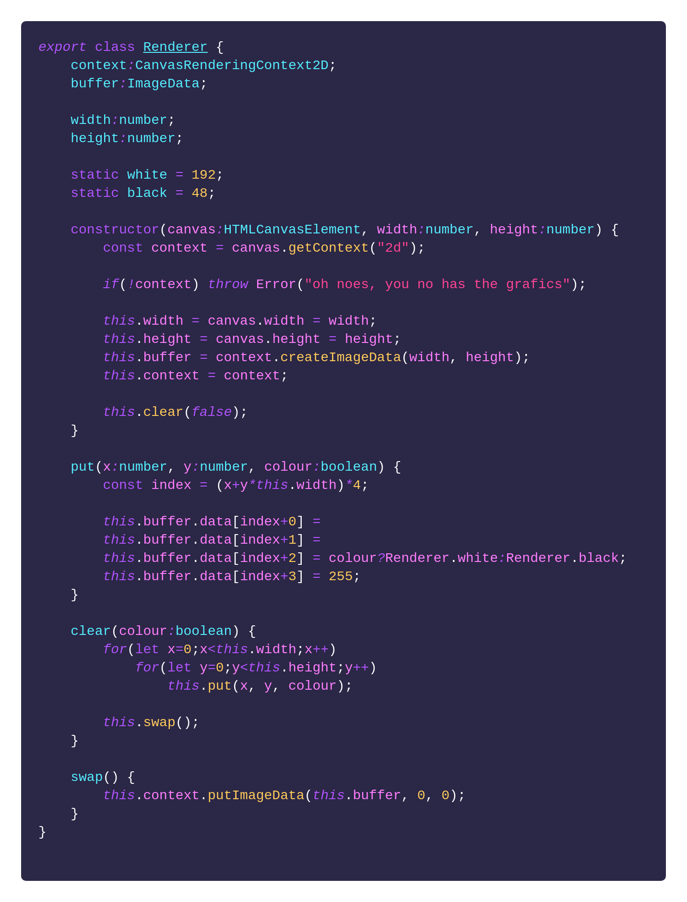

# luxjam-lightandshadow
A 48 hour gamejam entry for luxjam. Theme was "Light and shadow"

Music and sound effects by ᏒαyϺαrch

## Dev diary

### Friday 02:15

> \<ProPuke\> welp, I have chosen my "engine"..

I don't have an engine or lib to use for the jam, so I figure I'll do something super simple that runs in a browser.  
It'll be low res (running on a simple 2d canvas), only use 2 colours, and probably be some kind of symetrical puzzle game - light being the empty space on one side and dark on the other, so that changing one side changes the play space of the other. I figure maybe it'll be some weird tetris thing, but I'm not sure.  
Anyway, the first file I write is html. Huzzah!

### Friday 03:23

> \<ProPuke\> I have developed a state of the art renderer!

I hook up TypeScript compiling, and write a render class (*How does canvas work again?*).  
Some googling later and this is what I have.  
This pretty much stays the same (It can draw pixels and clear the screen! What more do you need?)

### Friday 03:58

> \<ProPuke\> I now have state of the art user feedback! (I can render text)

I figure being able to render text is probably a pretty important thing.  
I find a simple low res font at https://github.com/azmr/blit-fonts and write a renderer.  
I can draw text! :D

### Friday 04:14

So.. still not sure what I'm doing, but played with animating a simple titlescreen with light/dark play areas below.

Since I'm using Typescript I have modern `async` stuff so I can chuck `await sleep(x)` around in my code to make it pause in animations and stuff. So my code behaves like it's blocking, even though it's technically scheduled callbacks (continuation-style programming!). Useful for animations or game events where I may want to pause everything briefly.

I SLEEP!

### Saturday 13:34

> \<ProPuke\> There's a game in there somewhere.. maybe?

I added some destructive "physics", and spawned some balls in with a random chance to multiballs.  
Destruction is pretty.

### Saturday 13:41

> \<ProPuke\> status update: still no idea what I'm doing. Things are definitely happening, though ¯\\\_(ツ)\_/¯

I just kinda play with some things here. Turns out my "physics" were pretty borked, so I fix that up

### Saturday 14:52

> \<ProPuke\> apparently I'm making pong, now ¯\\\_(ツ)\_/¯

I added some paddles, and it's like pong, but a bit rubbish. Also physics is still a bit borked, with balls tunneling into the walls a bit. I kinda like that, though.

### Saturday 15:08

> \<ProPuke\> status update: still don't really know. Kinda made pong.. I will add explosives - That's the trick to making games!

I play for a while, not sure what to do, then I realise what I need to add - **explosives!**

### Saturday 15:47

> \<ProPuke\> has explosions, still not game..

They're in! Big flashy bombs you can hit! Explosions are nice - that's a bit more gamelike! But, not sure how I'd wire this into game mechanics yet

I think I probably disappeared for a bit here to eat and socialise with other humans (to clarify that's eating *food*, I only socialised with the humans)

### Saturday 21:17

A bit lost as to what to do. After some pondering I reckon I'd like some kind of charge system - like maybe as you bounce faster a meter builds, and when at max it charges up until you earn a bomb (at this point I'm thinking maybe give air control over the balls, and get rid of the paddles).

This mean lots of boring reading about the Web Audio API.  
Also I have to use the npm `http-server` module to test locally, as the page now needs to be behind a webserver in order to load the sound effect resources.

I used [brfx](https://www.bfxr.net/) to generate some simple sound effects (these later got replaced)

*Eww, yucky loading code*

I ate food and stuff

### Saturday 23:41

Fixed a ton of awkward bugs with the ball getting trapped in places.

Added proper directional paddle control and that felt good, so decided to keep them and focus on the pong theme.

But I wanna keep the bombs and chaos from before, so need to fit that in as gameplay somehow..

### Sunday 02:58

Added a "super" mode. allowing your ball to temporarily cut through walls.

After every 4 bombs you set off your ball is granted super mode for a brief period.

### Sunday 04:14

> \<ProPuke\> status update: trying to simplify things down to a "game", so no exciting chaos ¯\\\_(ツ)\_/¯  
\<ProPuke\> also, sound effects - so many sound effects

So finally tying some game mechanics down. I'm a little sad to do this, as I'm afraid of losing some of the "chaos" I've had the earlier experiments. Hopefully I haven't make it too much slower by doing so..

Added paddle combos!  
Each time you hit the note goes up (yay, that feels good), until you miss.
Hitting the paddle will also speed the ball up, where as missing will slow it down, so being accurate starts to give you a game advantage. It's like.. real gameplay?

My boi ᏒαyϺαrch said he'll join and do music!!

A great sleepening occurs..

### Sunday ?

Okay, so proper music and stuff is happening! But that means I need to send ᏒαyϺαrch a copy of the game. It's never left my machine yet so a bit scary to share it for the first time. It also needs to kinda work.. as a game..

### Sunday 16:19

> \<ProPuke\> status update: I'm fine, everything fine *PANIC*. I mean, wrapping up lots of game *PANIC* mechanics now. This has all been fairly relax.. *PANIC THERE IS A DEADLINE*

So my comment above on discord may have been in slight jest, but there was foreboding truth to it. In the next few hours I WILL start to seriously panic.

### Sunday 16:59 (5 hours remain..)

I've spent far too long chasing an awkward bug with balls getting stuck in place to due to some bad math; I really wish NaN didn't exist. Go away NaN, get out of my equations. Nobody likes you. (do we have a programming language that helps avoid this problem yet?)

### Sunday 17:12

Okay, combos!

I now have hud segments at the bottom that light up as you hit blocks to earn bombs and markers for bombs exploded that earn super mode!

It's finally starting to actually look like a real game, almost.. Time to share!

### Sunday 17:23

I packaged it up (so npm can install http-server and launch automatically). My boi now has something to tinker with and get a feel for so he can do music and add in *proper* sound effects (I will miss my low quality placeholders)

### Sunday 18:00 (4 hours remain..)

My brain has started to realise that time is short, and is now silently panicing. I start to lose IQ points from here on out :S

Me and the Ϻαrch discuss sound stuff while my brain silently freaks out in the background.

### Sunday 19:20

I improve the intro animation, show onscreen controls, and prompt the player to tap the screen to start. Tapping to start is actually a slight trick - you can't play any sound in HTML5 unless the user has interacted with your "page" in some way, so them tapping lets me start the music and enable sound effects.

I've had the intro animation disabled for most of this, so having an actual introduction makes it feel like a real game again.

### Sunday 19:55 (2 hours remain..)

Ma boi has come through with sounds effects, and they're miles above what I had. A bit *too* professional in fact. My graphics look a bit simplistic now in comparison. We did discuss perhaps adding some post process shader effect to the pixels, but there's really not the time.

So many things I'd do, and bugs I'd fix, but I really have to prioritise my efforts.

Meanwhile the panic monster is starting to make a BIG fuss.

I spend the next hour and a half obsessing over how the sound effects play and tweaking them :S

### Sunday 21:43 (17 minutes remain)

Okay, you can finally actually win or lose the game!

This came in right at the end :S

I've actually been quite unsure what the win conditions should be, but I'm totally out of time. I settled for just counting the number of pixels of each colour and displaying the percentage of each; If one side reaches 80% (or 4 minutes pass without this happening) it triggers an endgame countdown before announcing the greater side the victor.

I have a high tension music track I can play on top that I haven't used, so I can play that as a warning during the endgame, before finally dropping the music altogether to just that track.

The end screen itself is deliberately abrupt - Just suddenly pause EVERYTHING for a second to get the player's attention, then a nice *gradual* animation reveal to either a win or lose message. This ended up feeling great with the end game sound effect ᏒαyϺαrch did. Really pleased with this.

I think ideally in games like this there'd be something for the player to satisifyingly destroy at the end so that the ending was player driven and felt satisfying. But no time to work that out, so will have to go with something quizically abrupt, ending them on a high. Hopefully the music transition serves as a high tension warning and they're really trying at the end and know a change is about to occur.

Now I just need to *publish* the damn thing. I've never done this on itch.io before. How do I package it? Will it even work?

I can't even think straight to work out what aspect ratio to give itch. I repeatedly try every pixel size until it happens to fit on screen :S

### Sunday 21:59 (1 minute remains)

> \<ProPuke\> status update: AHHHHHHHHHHHHHHHHHHHHHHHHHHHHH!

It is published! I am **done!**

...

...

...

Apparently there is an extra hour's grace. I can still do fixes! This is good cos LOTS of things still need polish or very broken!

...

### Sunday 22:43

Music now properly fades out instead of suddenly stopping  
The arrow keys would annoying scroll the page on itch when not in fullscreen mode, oops
Firefox blurred all the pixels instead of keeping them sharp  
Ball would get trapped on the other side a lot, because hitting the enemy wall would slow it down (as it counted as a paddle missing it)  
80% was too hard a win condition and 4 minutes went on too long, so drop to 75% and 3 minutes  
The hud segments get improved slightly in style

I finally send the final final version.. Then have a celebratory poo!

I might not have fixed *all* the bugs, but I think the big ones are all done, and I've done the best I can, and I can finally let go.